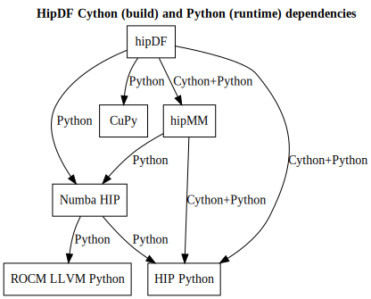

# Installing hipDF

> [!IMPORTANT]
> We do not yet distribute prebuilt packages via Conda or PyPI for this project and its dependencies. So you need to build from source for now.
> This documents walks you through all necessary steps.
> For your convenience, we have also condensed these steps into the [install_hipdf.sh](install_hipdf.sh) script. Make sure to read it carefully and adapt the environment variables to your needs.

## Install from Source

> [!IMPORTANT]
> In this guide we are assuming a MI200 series GPU and thus use the architecture code `gfx90a` in our build steps. Adapt this to your needs.

### Install ROCm

We assume that you have a full ROCm installation on your system. [^rocm]
In this guide we assume that you have installed ROCm to `/opt/rocm`.

### Install Conda

We require that you build `hipDF` inside of a predefined Conda environment to ensure that it is working properly. A minimum free version of Conda is Miniconda [^miniconda].

### Cython and Python dependencies: CuPy, Numba HIP, hipMM, HIP Python, ROCm LLVM Python

While the hipDF build process fetches C++ dependencies itself, it has Cython and Python dependencies (CuPy, Numba HIP, hipMM, HIP Python, ROCm LLVM Python) that need to be installed into the hipDF Conda environment before you can build the project. The following diagram gives an overview:



### Install Procedure in Short

We will perform the following steps:

1. Install ROCm
2. Install Conda
3. Create build folder
    * Download ROCm CuPy
    * Download hipMM
    * Download hipDF
4. Build CuPy wheel
5. Create and activate hipDF Conda environment `hipdf_dev`
6. Install CuPy wheel into `hipdf_dev`
7. Install Numba HIP into `hipdf_dev`
8. Install hipMM into `hipdf_dev`
9. Install hipDF into `hipdf_dev`

> [!NOTE]
> Be aware that `install_hipdf.sh` script deviates slightly in the order of operations. One key difference is that it assumes that hipDF is already downloaded.

### Install Procedure in Detail

Let's go through the installation steps in detail.

#### Step 3: Create build folder

```bash
mkdir -p /tmp/hipdf # NOTE: feel free to adapt
cd /tmp/hipdf
git clone https://github.com/ROCm/hipDF hipdf -b branch-23.10
git clone https://github.com/ROCm/hipMM hipmm -b branch-23.12
git clone https://github.com/ROCm/cupy cupy -b aiss/cai-branch
```

#### Step 4: Create CuPy wheel

> [!IMPORTANT]
> You need to provide one or more AMD GPU architectures here via
> the `HCC_AMDGPU_TARGET` environment variable (separator: `,`).

To compile CuPy you need a legacy version of Cython.The Conda environment file (`cupy.yaml`) is shown below. Note that while you can adapt the Python version, you should not modify the Cython version.

```yaml
# file: cupy.yaml
channels:
- conda-forge
dependencies:
- python~=3.10.0 # NOTE: adapt to your needs, must match hipDF Python version version
- cython==0.29.35
```

We then build as follows:

```bash
cd /tmp/hipdf/cupy

# initialize conda environment
conda env create -n cupy_dev -f cupy_dev.yaml
conda activate cupy_dev # now we are working in the `cupy_dev` conda env

pip install --upgrade pip # always recommended

# cd <path/to/parent-directory>
git submodule update --init
export CUPY_INSTALL_USE_HIP=1
export ROCM_HOME=/opt/rocm        # NOTE: adapt to your environment
export HCC_AMDGPU_TARGET="gfx90a" # NOTE: adapt to your AMD GPU architecture
python3 setup.py bdist_wheel      # build the wheel
```

#### Step 5: Create and activate hipDF Conda environment `hipdf_dev`.

Next, we create the `hipdf_dev` Conda environment:

```bash
cd /tmp/hipdf/hipdf

conda env create --name hipdf_dev --file conda/environments/all_rocm_arch-x86_64.yaml
```

You can activate the environment via

```bash
conda activate hipdf_dev
```

#### Step 6: Install CuPy into `hipdf_dev`

```bash
# IMPORTANT: conda env `hipdf_dev` must be active

pip install /tmp/hipdf/cupy/dist/cupy*.whl
```

#### Step 7: Install Numba HIP into `hipdf_dev`.

> [!IMPORTANT]
> You need to provide the version of your ROCm installation here via the optional dependency key `rocm-X-Y-Z`.

```bash
# IMPORTANT: conda env `hipdf_dev` must be active

pip install --upgrade pip
pip config set global.extra-index-url https://test.pypi.org/simple
pip install numba-hip[rocm-6-3-0]@git+https://github.com/rocm/numba-hip.git # NOTE: adapt ROCm key to your Python version
```

#### Step 8: Install hipMM into `hipdf_dev`.

We are only interested in installing the hipMM Python wheel. We do this via hipMM's `build.sh` script as shown below:

```bash
# IMPORTANT: conda env `hipdf_dev` must be active

export CXX="hipcc"  # Cython CXX compiler, adapt to your environment
export CMAKE_PREFIX_PATH="${CMAKE_PREFIX_PATH}:/opt/rocm/lib/cmake" # NOTE: ROCm CMake package location, adapt to your environment

./build.sh rmm # Build rmm and install into `hipdf_dev` conda env.
```

Note that no architecture must be set here as the hipMM installation does not compile any device code.

#### Step 9: Install hipDF into `hipdf_dev`

> [!IMPORTANT]
> You need to provide one or more AMD GPU architectures here via
> the `CUDF_CMAKE_HIP_ARCHITECTURES` environment variable (separator: `;`).

We install the `hipdf` Python package as shown below:

```bash
# IMPORTANT: conda env `hipdf_dev` must be active

export CXX="hipcc"  # Cython CXX compiler, adapt to your environment
export CMAKE_PREFIX_PATH=${CMAKE_PREFIX_PATH}:/opt/rocm/lib/cmake

export PARALLEL_LEVEL=16 # NOTE: number of build threads, adapt as needed

export LDFLAGS="-Wl,-O2 -Wl,--sort-common -Wl,--as-needed -Wl,-z,relro -Wl,-z,now -Wl,--disable-new-dtags -Wl,--gc-sections -Wl,--allow-shlib-undefined -Wl,-rpath,/lib/x86_64-linux-gnu/ -Wl,-rpath,${CONDA_PREFIX}/lib -Wl,-rpath-link,${CONDA_PREFIX}/lib -L${CONDA_PREFIX}/lib"

export CUDF_CMAKE_HIP_ARCHITECTURES="gfx90a" # NOTE: adapt to your AMD GPU architecture

bash build.sh cudf # NOTE: the build target is called 'cudf'
```

<!--References-->

[^rocm]: <https://rocm.docs.amd.com/projects/install-on-linux/en/latest/>
[^miniconda]: <https://docs.anaconda.com/miniconda/#>
[^hip_python]: <https://rocm.docs.amd.com/projects/hip-python/en/latest/>
[^cupy]: <https://rocm.docs.amd.com/projects/hip-python/en/latest/>
