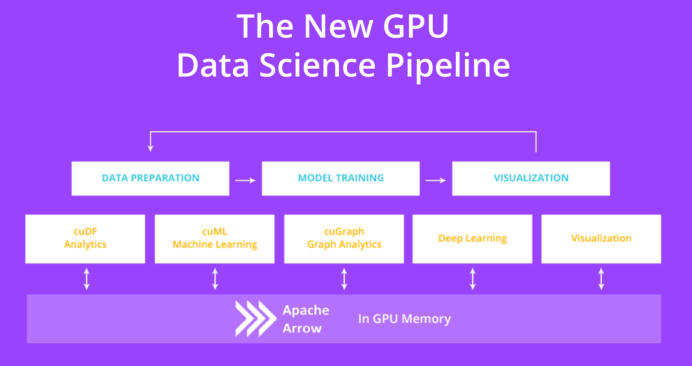

# <div align="left">&nbsp;hipDF - GPU DataFrames on AMD GPUs</div>

> [!CAUTION] 
> This release is an *early-access* software technology preview. Running production workloads is *not* recommended.
***
> [!NOTE]
> This README is derived from the original RAPIDSAI project's README. More care is necessary to remove/modify parts that are only applicable to the original version.

> [!NOTE]
> This repository will be eventually moved to the [ROCm-DS](https://github.com/rocm-ds) Github organization.

> [!NOTE]
> This ROCm&trade; port is derived work based on the NVIDIA RAPIDS&reg; cuDF project. It aims to
follow the latter's directory structure and API naming as closely as possible to minimize porting friction for users that are interested in using both projects.

## Resources

- [cuDF Reference Documentation](https://docs.rapids.ai/api/cudf/stable/): Python API reference, tutorials, and topic guides.
- [libcudf Reference Documentation](https://docs.rapids.ai/api/libcudf/stable/): C/C++ GPU library API reference.
- [Getting Started](https://rapids.ai/start.html): Instructions for installing cuDF.
- [RAPIDS Community](https://rapids.ai/community.html): Get help, contribute, and collaborate.
- [GitHub repository](https://github.com/rapidsai/cudf): Download the cuDF source code.
- [Issue tracker](https://github.com/rapidsai/cudf/issues): Report issues or request features.

## Overview

Built based on the [Apache Arrow](http://arrow.apache.org/) columnar memory format, hipDF is a GPU DataFrame library for loading, joining, aggregating, filtering, and otherwise manipulating data.

hipDF provides a pandas-like API that will be familiar to data engineers & data scientists, so they can use it to easily accelerate their workflows without going into the details of HIP programming.

For example, the following snippet downloads a CSV, then uses the GPU to parse it into rows and columns and run calculations:
```python
import cudf, requests
from io import StringIO

url = "https://github.com/plotly/datasets/raw/master/tips.csv"
content = requests.get(url).content.decode('utf-8')

tips_df = cudf.read_csv(StringIO(content))
tips_df['tip_percentage'] = tips_df['tip'] / tips_df['total_bill'] * 100

# display average tip by dining party size
print(tips_df.groupby('size').tip_percentage.mean())
```

Output:
```
size
1    21.729201548727808
2    16.571919173482897
3    15.215685473711837
4    14.594900639351332
5    14.149548965142023
6    15.622920072028379
Name: tip_percentage, dtype: float64
```

For additional examples, browse the complete [cuDF API documentation](https://docs.rapids.ai/api/cudf/stable/), or check out the more detailed [cuDF notebooks](https://github.com/rapidsai/notebooks-contrib).

## Quick Start

> [!NOTE]
> Currently, a docker image is not available for AMD GPUs.

## Installation


> [!NOTE]
> We support only AMD GPUs. Use the RAPIDS package for NVIDIA GPUs.

### ROCm/GPU Requirements

* ROCm HIP SDK compilers version 6.3+
* Officially supported architecture (gfx90a, gfx942, gfx1100).

<!-- ### CUDA/GPU requirements

* CUDA 11.2+
* NVIDIA driver 450.80.02+
* Pascal architecture or better (Compute Capability >=6.0)

### Conda

> [!NOTE]
> Currently, this option is not supported for AMD GPUs.

hipDF can be installed with conda (via [miniconda](https://conda.io/miniconda.html) or the full [Anaconda distribution](https://www.anaconda.com/download)) from the `rapidsai` channel:

```bash
# NOTE: Conda installation not supported for hipDF for AMD GPUs.
conda install -c rapidsai -c conda-forge -c nvidia \
    cudf=23.10 python=3.10 cuda-version=11.8
```

We also provide [nightly Conda packages](https://anaconda.org/rapidsai-nightly) built from the HEAD
of the latest cuDF development branch.

> [!NOTE]
> hipDF is supported only on Linux, and with Python versions 3.9 and later.

See the [Get RAPIDS version picker](https://rapids.ai/start.html) for more OS and version info. -->

## Build/Install from Source
See build [instructions](INSTALL.md).


## Open GPU Data Science

The ROCm-DS suite of open source software libraries aims to enable execution of end-to-end data science and analytics pipelines entirely on AMD GPUs. It relies on ROCm HIP primitives for low-level compute optimization, but exposing that GPU parallelism and high-bandwidth memory speed through user-friendly Python interfaces.

<p align="center"></p>

### Apache Arrow on GPU

The GPU version of [Apache Arrow](https://arrow.apache.org/) is a common API that enables efficient interchange of tabular data between processes running on the GPU. End-to-end computation on the GPU avoids unnecessary copying and converting of data off the GPU, reducing compute time and cost for high-performance analytics common in artificial intelligence workloads. As the name implies, hipDF uses the Apache Arrow columnar data format on the GPU. Currently, a subset of the features in Apache Arrow are supported.
